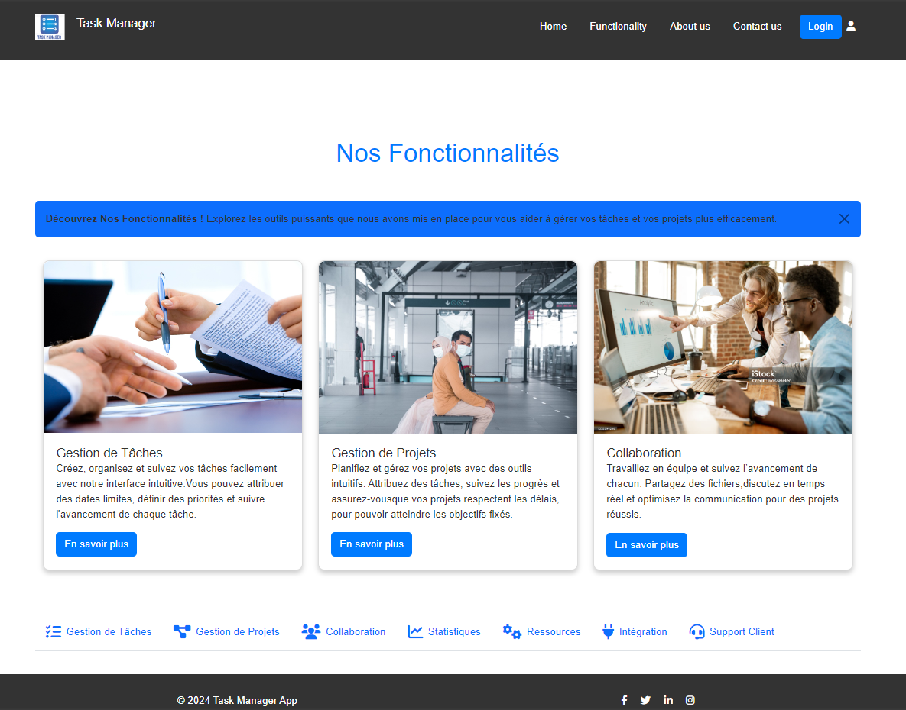
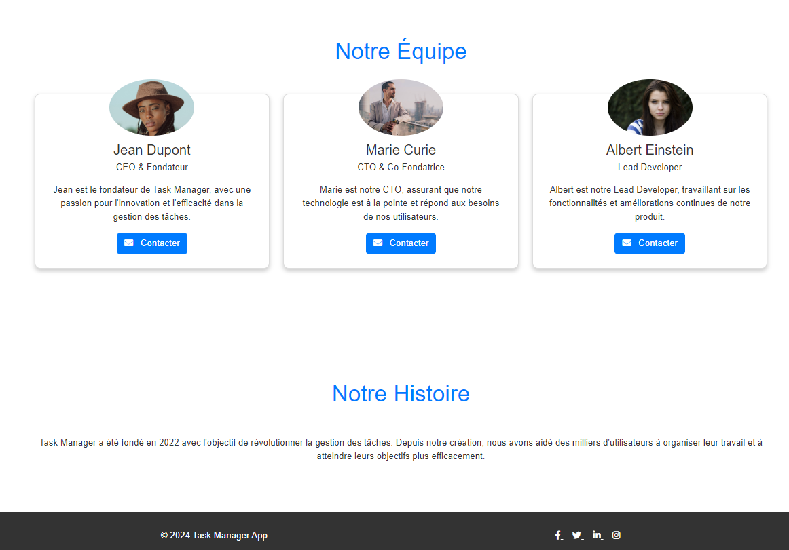
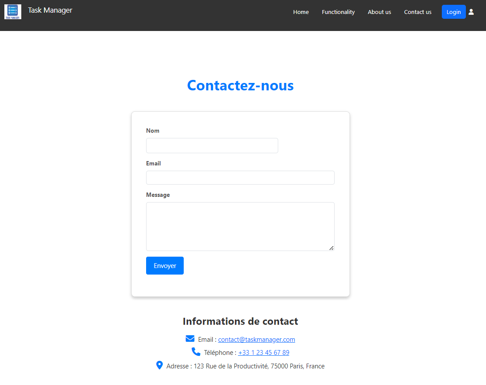
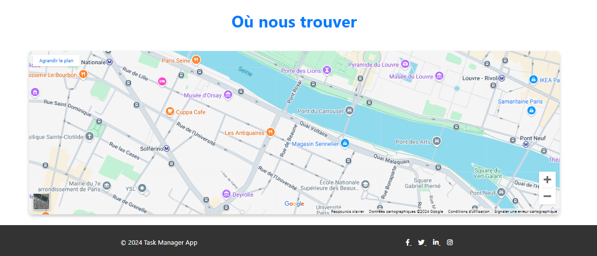
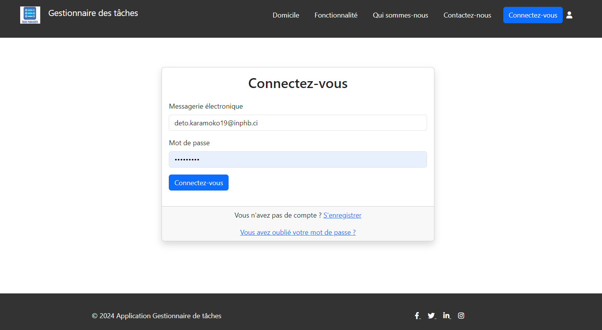
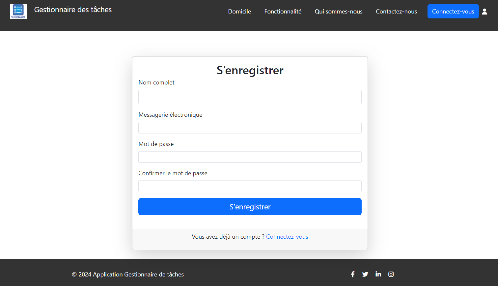
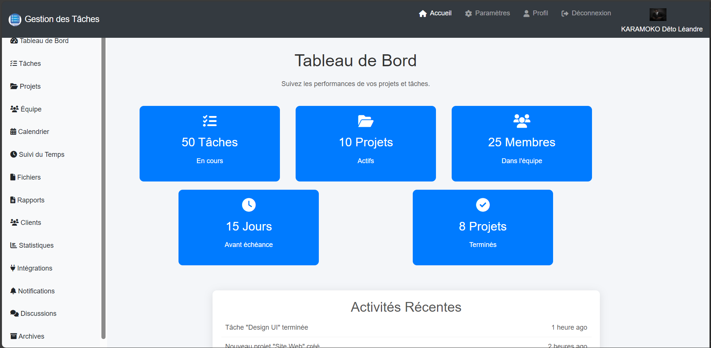
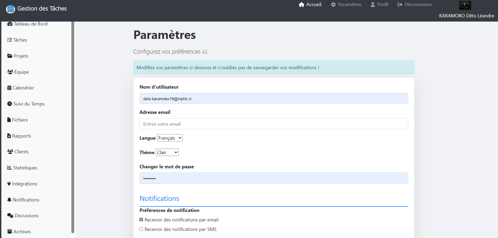
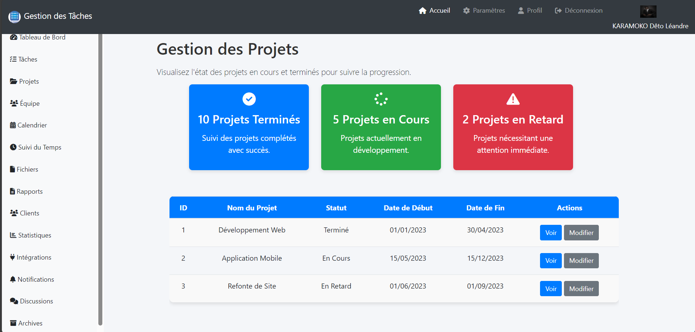

===============================     # ARCHITECTURE PROJECT TASK MANAGER      ===============================

project-task-manager/
├── src/
│   ├── config.php                # Configuration générale de l'application
│   ├── controllers/              # Contrôleurs pour gérer la logique de l'application
│   │   ├── AuthController.php    # Contrôleur pour l'authentification
│   │   ├── DashboardController.php # Contrôleur pour le tableau de bord
│   │   └── TaskController.php    # Contrôleur pour les tâches
|       |__ view-dashboard
            |__home-controller.php
|
│   ├── models/                   # Modèles représentant les entités de la base de données
│   │   ├── User.php              # Modèle pour l'entité utilisateur
│   │   ├── Task.php              # Modèle pour l'entité tâche
│   │   └── (other models)
│   ├── repositories/             # Repositories pour accéder aux données et effectuer des opérations CRUD
│   │   ├── UserRepository.php    # Repository pour l'accès aux utilisateurs
│   │   ├── TaskRepository.php    # Repository pour l'accès aux tâches
│   │   └── (other repositories)
│   ├── services/                 # Services pour la logique métier
│   │   ├── AuthService.php       # Service pour la gestion de l'authentification
│   │   ├── TaskService.php       # Service pour la gestion des tâches
│   │   └── (other services)
│   ├── handlers/                 # Gestionnaires pour les exceptions et autres traitements globaux
│   │   └── ExceptionHandler.php  # Gestionnaire d'exceptions global
│   └── helpers/                  # Fonctions utilitaires ou aides
│       └── (utility functions)
├── database/
│   └── db-config.php             # Configuration de la base de données
├── vendor/                       # Dépendances Composer (comme PHPMailer)
├── views/

│   ├── auth/                     # Pages d'authentification (login, sign up, reset password)
│   │   ├── login.php
│   │   ├── sign.php
│   │   ├── forget-password.php
│   │   ├── reset-password.php
│   │   └── dashboard/
│   │       ├── home-dashboard.php
│   │       └── partials-dashboard/
│   │       |    └── header-dashboard.php
│   │       |    ├── footer-dashboard.php
     
├── js/                           # Scripts JavaScript
│   ├── sign.js                   # Script de gestion du formulaire d'inscription
│   └── (other scripts)
├── css/                          # Feuilles de style CSS (si nécessaire)
│   └── styles.css
└── public/                       # Répertoire public pour les assets accessibles par le client
    └── index.php                 # Point d'entrée principal de l'application

