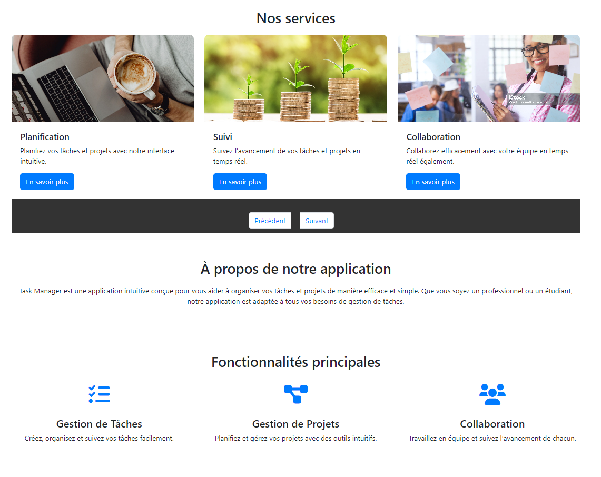

===============================   # ARCHITECTURE PROJECT TASK MANAGER    ===============================

project-task-manager/
├── src/
│   ├── config.php                # Configuration générale de l'application
│   ├── controllers/              # Contrôleurs pour gérer la logique de l'application
│   │   ├── AuthController.php    # Contrôleur pour l'authentification
│   │   ├── DashboardController.php # Contrôleur pour le tableau de bord
│   │   └── TaskController.php    # Contrôleur pour les tâches
|       |__ view-dashboard
            |__home-controller.php
|
│   ├── models/                   # Modèles représentant les entités de la base de données
│   │   ├── User.php              # Modèle pour l'entité utilisateur
│   │   ├── Task.php              # Modèle pour l'entité tâche
│   │   └── (other models)
│   ├── repositories/             # Repositories pour accéder aux données et effectuer des opérations CRUD
│   │   ├── UserRepository.php    # Repository pour l'accès aux utilisateurs
│   │   ├── TaskRepository.php    # Repository pour l'accès aux tâches
│   │   └── (other repositories)
│   ├── services/                 # Services pour la logique métier
│   │   ├── AuthService.php       # Service pour la gestion de l'authentification
│   │   ├── TaskService.php       # Service pour la gestion des tâches
│   │   └── (other services)
│   ├── handlers/                 # Gestionnaires pour les exceptions et autres traitements globaux
│   │   └── ExceptionHandler.php  # Gestionnaire d'exceptions global
│   └── helpers/                  # Fonctions utilitaires ou aides
│       └── (utility functions)
├── database/
│   └── db-config.php             # Configuration de la base de données
├── vendor/                       # Dépendances Composer (comme PHPMailer)
├── views/

│   ├── auth/                     # Pages d'authentification (login, sign up, reset password)
│   │   ├── login.php
│   │   ├── sign.php
│   │   ├── forget-password.php
│   │   ├── reset-password.php
│   │   └── dashboard/
│   │       ├── home-dashboard.php
│   │       └── partials-dashboard/
│   │       |    └── header-dashboard.php
│   │       |    ├── footer-dashboard.php
     
├── js/                           # Scripts JavaScript
│   ├── sign.js                   # Script de gestion du formulaire d'inscription
│   └── (other scripts)
├── css/                          # Feuilles de style CSS (si nécessaire)
│   └── styles.css
└── public/                       # Répertoire public pour les assets accessibles par le client
    └── index.php                 # Point d'entrée principal de l'application

===============================   # DESCRIPTION PROJECT TASK MANAGER    ===============================

Ce projet de gestion de tâches a été conçu et développé en adoptant une architecture trois tiers 
pour garantir une séparation claire des responsabilités et faciliter la maintenabilité du code. 
L'objectif principal était de fournir une solution personnalisée adaptée aux besoins spécifiques du 
client, sans avoir recours à des templates ou à des frameworks préexistants. Chaque couche de l'architecture 
a été mise en place manuellement, démontrant une approche artisanale et sur mesure du développement.

Structure de l'architecture :
Couche de présentation (Front-end) :

    -Le front-end de l'application a été développé en utilisant des technologies web classiques 
    telles que HTML, CSS, JavaScript, ainsi que Bootstrap pour la conception et la mise en forme réactive des pages.
    L'interface utilisateur est intuitive et permet aux utilisateurs de gérer efficacement leurs tâches 
    grâce à une navigation fluide et à des fonctionnalités interactives. Les formulaires, boutons et tableaux sont 
    stylisés avec Bootstrap pour offrir une expérience utilisateur moderne et uniforme sur divers appareils.
    L'accent a été mis sur la simplicité et l'efficacité, avec des fonctionnalités de base telles que 
    la création, la mise à jour, la suppression et la consultation des tâches, tout en assurant une bonne organisation 
    des données visuelles.Couche métier (Back-end) :

    -La logique métier a été entièrement développée en PHP, assurant une gestion efficace des tâches, 
    des utilisateurs, et des relations entre ces entités. L'application PHP gère toutes les opérations 
    CRUD (Create, Read, Update, Delete) sur les différentes entités du système.
    L'architecture a été pensée pour être modulaire, permettant une évolutivité future tout en assurant 
    une bonne lisibilité du code. Des classes spécifiques sont responsables du traitement des requêtes entrantes, 
    de la validation des données et de la gestion des erreurs, ce qui facilite la maintenabilité et les modifications futures.
    Chaque fonctionnalité métier est clairement définie et séparée, ce qui permet une adaptation facile 
    à d'autres besoins éventuels du client. Couche de données (Base de données) :

    -Le projet repose sur une base de données MariaDB, une solution robuste et performante dérivée de MySQL. 
    La base de données est bien structurée avec des tables adaptées pour gérer les utilisateurs, les tâches, 
    les priorités, les statuts des tâches et les relations entre ces entités.
    Les tables de la base de données suivent une conception relationnelle stricte avec des clés primaires, 
    des clés étrangères et des contraintes d'intégrité pour garantir la cohérence des données.
    Des optimisations ont été mises en place pour garantir des performances élevées lors des opérations 
    de lecture/écriture, en particulier pour gérer des volumes croissants de données à mesure que l'application évolue.
    Fonctionnalités principales :

    -Gestion des tâches : Les utilisateurs peuvent ajouter, modifier, supprimer et consulter des tâches avec 
    des informations telles que le titre, la description, la priorité, et le statut.
    Suivi des statuts des tâches : Chaque tâche peut être marquée comme "En cours", 
    "Terminée", ou "En attente", facilitant ainsi la gestion du flux de travail.
    Gestion des utilisateurs : Le système permet la gestion de plusieurs utilisateurs avec des droits 
    d'accès appropriés. Chaque utilisateur a la possibilité de gérer ses propres tâches ou de collaborer sur 
    des tâches partagées avec d'autres utilisateurs. Points techniques remarquables :

    -Sans template ni framework : Tout le projet a été développé à partir de zéro, sans utiliser de 
    frameworks ou de templates existants. Cette approche garantit une maîtrise totale du code et une 
    flexibilité maximale pour les futures évolutions. Réactivité et accessibilité : Grâce à Bootstrap, 
    l'application est entièrement réactive et compatible avec différents appareils (ordinateurs, tablettes, smartphones).
    Système modulaire : La séparation en couches (front-end, back-end et base de données) permet de maintenir un code propre, 
    évolutif et facilement testable.

    Sécurité : Des mécanismes de validation des données sont en place 
    pour éviter les injections SQL et d'autres attaques potentielles courantes sur le web.

    Conclusion :
    Ce projet de gestion de tâches est une solution entièrement personnalisée, 
    construite avec des technologies simples mais efficaces. L'absence de framework et l'approche manuelle 
    adoptée pour l'implémentation ont permis de fournir une application légère, adaptable et extensible en fonction 
    des besoins futurs du client. Ce projet est un exemple d'ingénierie logicielle orientée vers la simplicité, 
    l'efficacité et la maintenabilité.

    NB: Le projet a été implémenter sans template ni framework.

